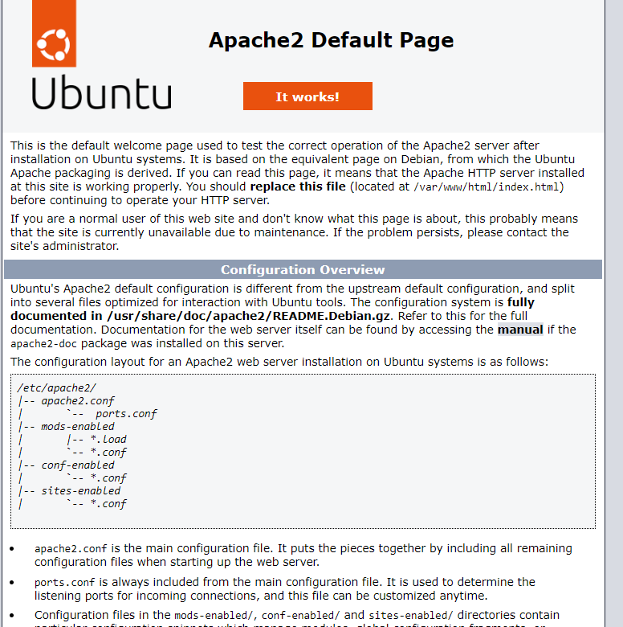
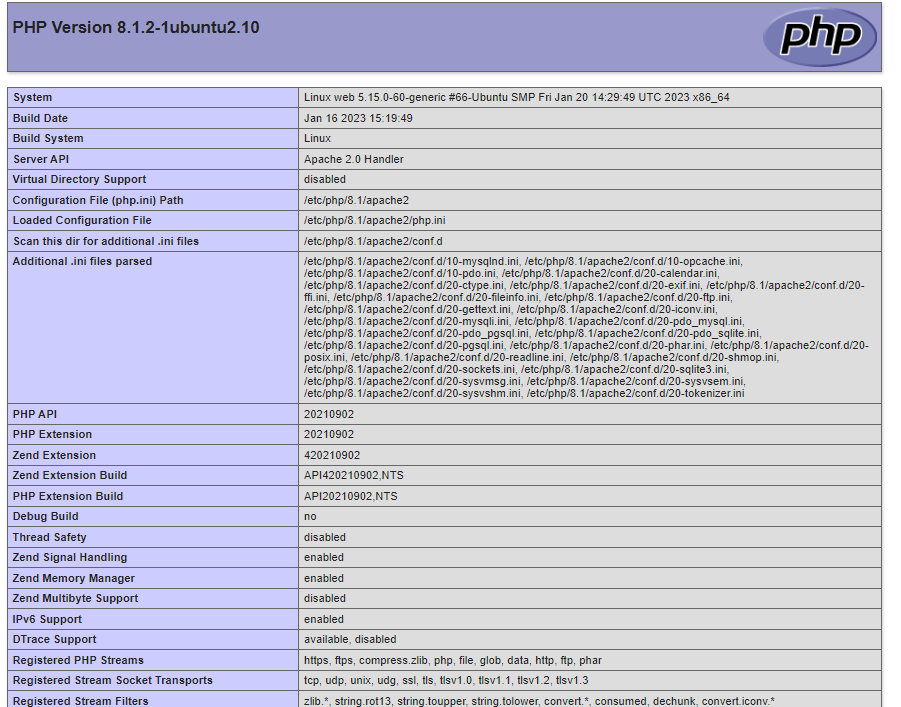
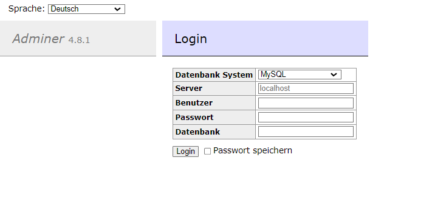
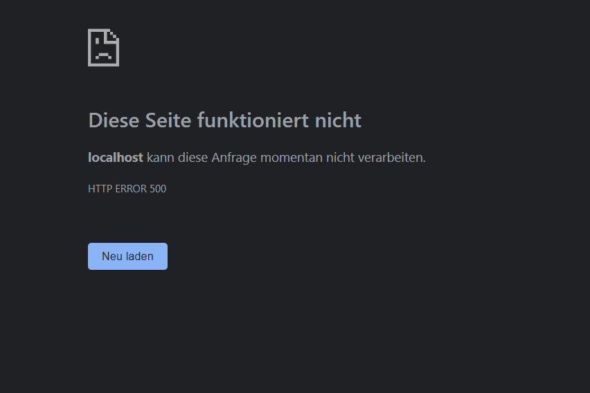

# KN02

## A

## B

Apache

Index

## C

### a

Index

Info

Adminer

DB

### b

Auf die Datenbank kann nicht zugegriffen werden, da die Berechtigungen nicht korrekt sind. Die Datenbank akzeptiert keine Verbindung von aussen und die konfiguration für den DB user stimmen auch nicht

