# KN01

## Lab 4.1

### HTML

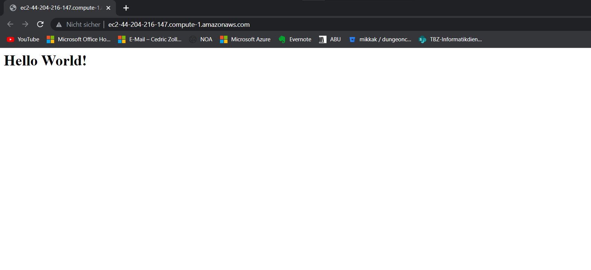

Online instanz nach der Sicherheitsgruppen Bearbeitung und Zugriff auf die Öffentliche IP

### Instanzen und Details

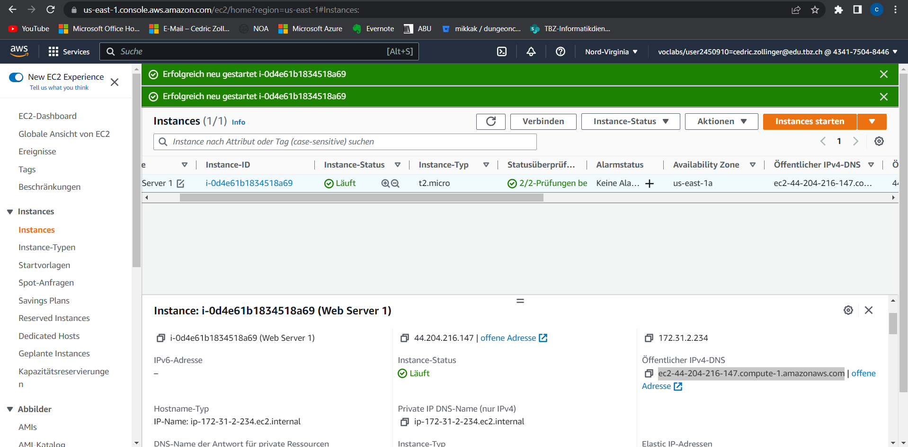

Oben sind ist die Liste der Erstellten Instanzen zu sehen so wie einige Informationen über die Jeweilige Instanz.

In der Detailansicht unten sind die genauere Informationen zu der ausgewählten Instanz zu sehen.

### Sicherheitsgrupen

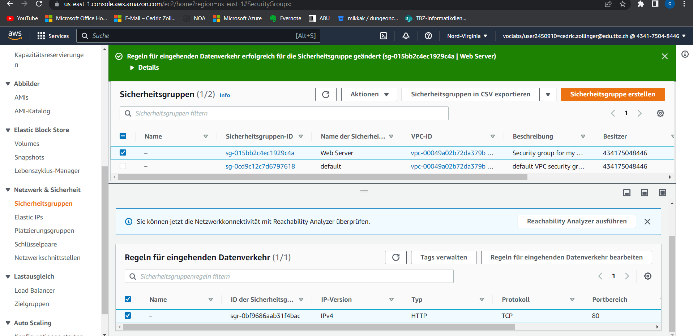

Zu sehen sind die Security Inbound Einstellungen für die Ausewählte Sicherheitsgruppe (Web Server).
Die Detailsansicht der Regel bietet einige Informationen über die Konfiguration

## Lab 4.2

### Bucket List

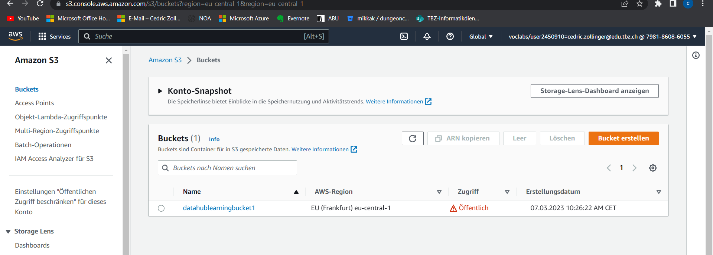

Liste von Buckets im S3

### HTML

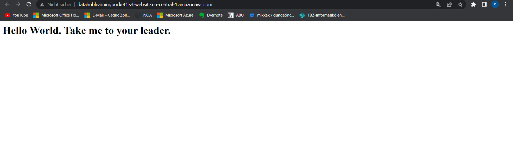

HTMl index seite nach der KOnfigurierung des statischen Web hostings

### Bucket Objects

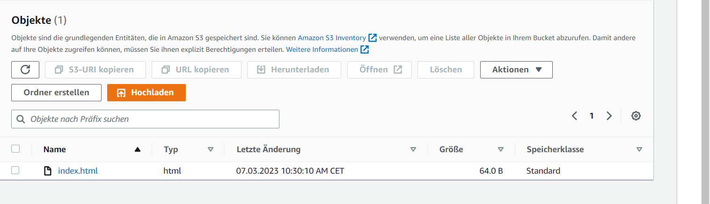

Liste der Objekte im ausgewählten S3 Bucket

### Static Web hosting properties

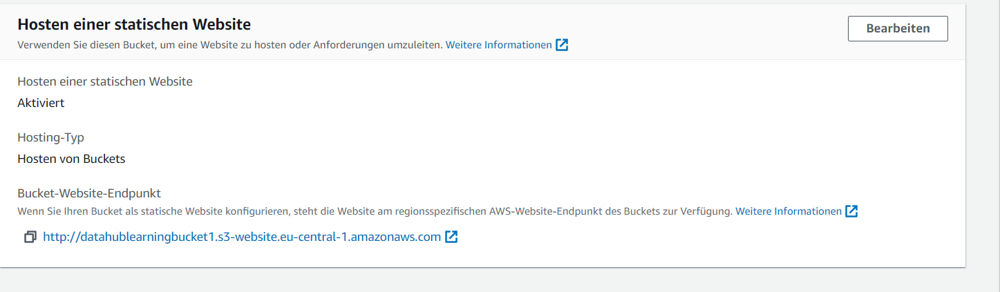

Informationen zur Statischen Web Hosting Konfiguration

### Instanzen

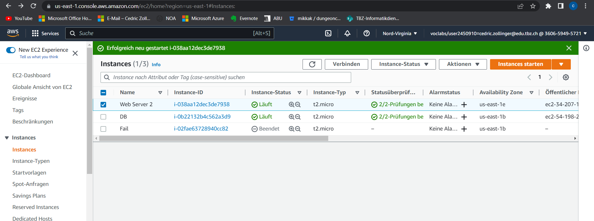

Instanzen des Web servers und der DB

## B

ssh_pwauth (value)

konfihuriert ob passwort sshd akzeptiert wird

true

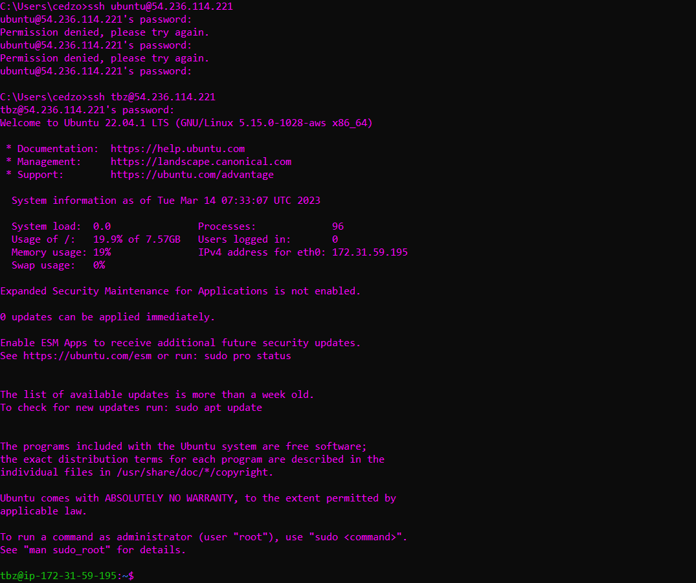

false

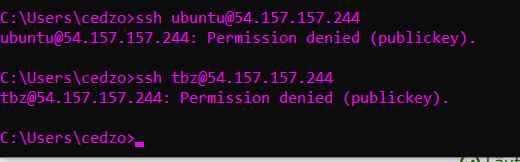

## C

1

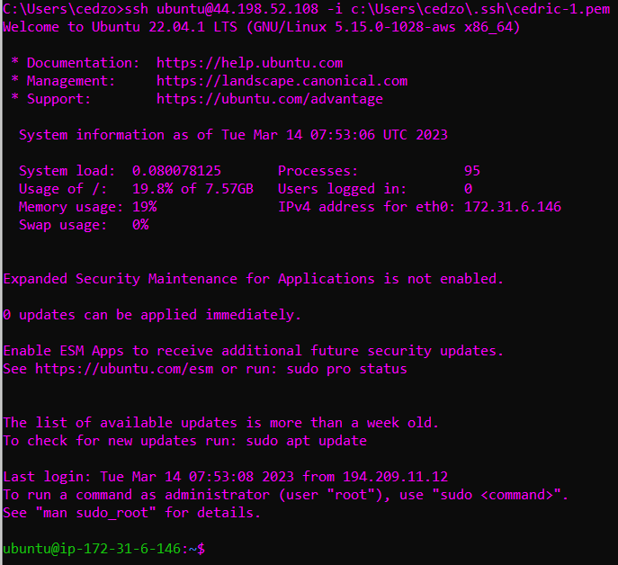

2

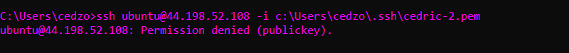

## d
SSH init config

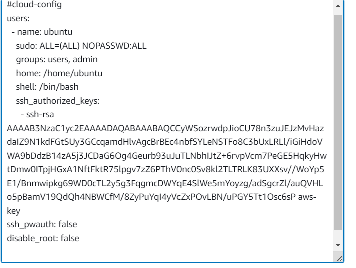

Pem 1

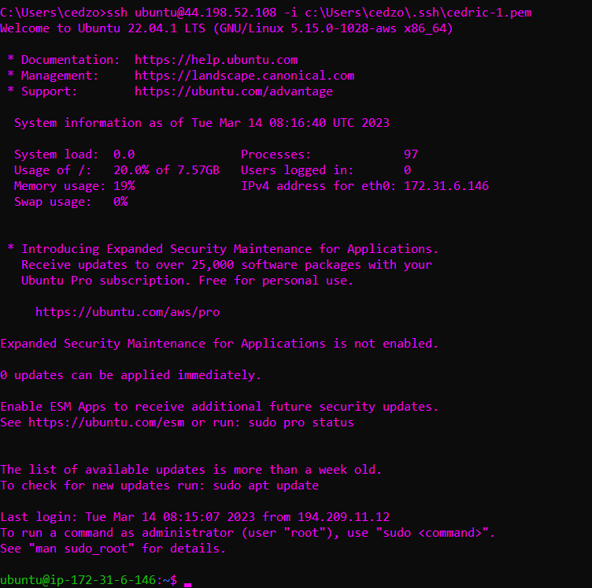

Pem 2

