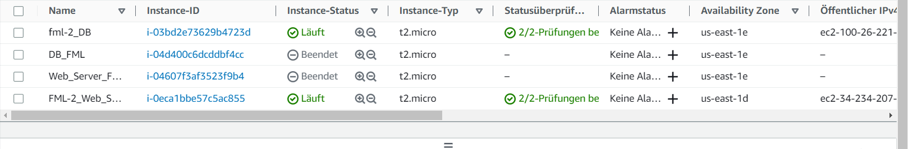

# KN04

## A

### Instanz Details

Instanz typen

Instanz Speicher

Instanz Userdata

Instanzen
 
 DB Instanz

Webserver Instanz

Liste der Instanzen

### Sites

/db.php

/info.php

adminer page nach login mit admin credentials

#### db konfiguration

db Server: /etc/mysql/mariadb.conf.d
localhost auf 0.0.0.0 ändern

## B

### a

Der S3 Speicher ist ein Object Storage. Daten werden als Objekte abgespeichert. Diese liegen in einem grossen Verzeichnis und ohne hirarchie.

### b 

#### 4

Das bei der erstellung der Instanz mit erstellte Volume wird mti gelöscht. Andere verknüpfte Ressourcen könnten weiterhin existieren

#### 5

Bei EBS Volumes kann der Wert von "Delete on termination" auf true gesetzt werden. Das heisst das bei der Terminierung der Instanz auch die ängehängten EBS Volumes mit dem Wert auf true mitgelöscht werden. 

EBS Volumes

EBS Volume deleted
