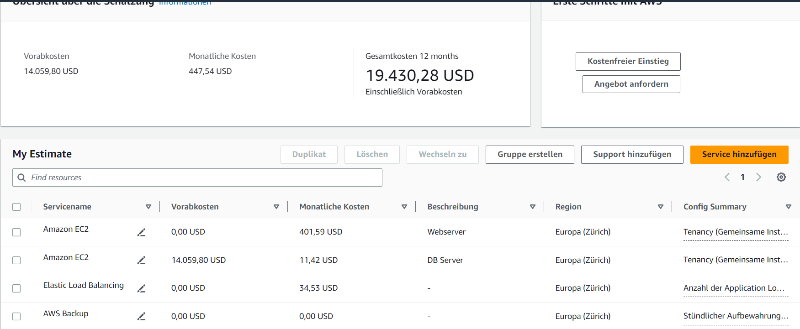
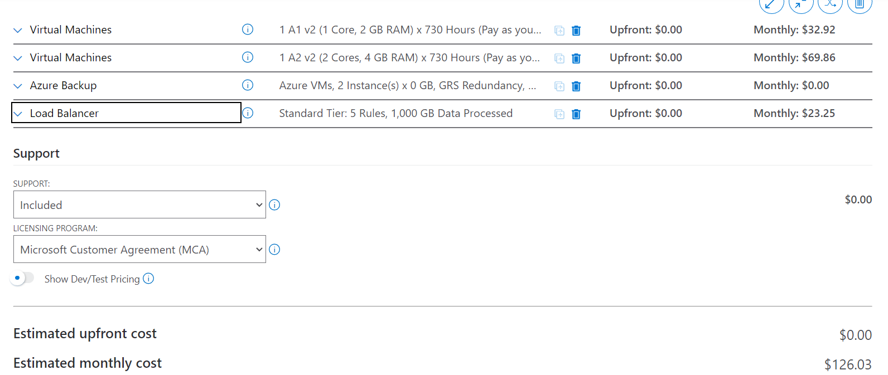
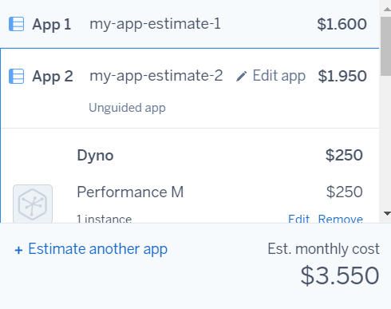
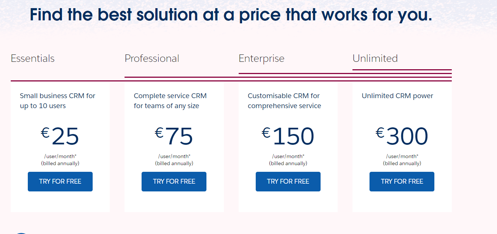

# KN 07

## A

### 1 Rehosting

AWS Kosten

Azure Kosten

Bei AWS konnte die genaue RAM Menge nicht ausgewählt werden. Der Webserver hat 2 GB statt 1 GB. Die Speichermenge konnte genau bestimmt werden. Leider konnten die Betriebssysteme nicht genau ausgewählt werden. Beide Instanzen laufen auf einem Linux. Der Loadbalancer ist sehr kompliziert, hier ist eine standardauswahl getroffen worden. Das Backup konnte gut eingestellt werden, auch wenn die Übersetzungen ein bisschen verwirren.

Azure ist simpler aufgebaut als AWS, vor allem auch übersichtlicher.
Bei Azure konnte jedoch keine genaue CPU und Ram konfiguration genommen werden, da diese vorkonfiguriert sind. Auch die Speichermenge wurde auf normale Speichergrössen wie 64GB, 128 GB usw. limitiert. Der Loadbalancer war jedoch simple und auch das Backup war sehr simple und genau einstellbar.

Also nach den berechnungen nehme ich definitiv Azure. Entweder meine Auswahlen stimmen komplett nicht, oder Amazon ist sehr Teuer. Selbst die Monatlichen Kosten ohne Vorauszahlung sind ca 3.5 mal so viel.

### 2 Replattforming

Bei Heroku ist die Auswahl grauenhaft was das Angebot angeht an services. Bei den Auswahlen ging ich immer auf die stgandard auswahlen mit den Werten so nah wie möglich den Anforderungen.

Heroku ist definitiv monatlich teurer als Azure oder AWS kombiniert. Jedoch für kurze zeit ist Heroku billiger als AWS, da bei AWS noch die Vorauszahlungen dazu kommen

### Repurchasing

Ausgewählt wurde Professional, da Essentials nur bis zu 10 Mitglieder unterstützt.

Die Webseite von Salesforce ist passend zum namen. Es zwingt einen dazu angaben zu machen, service in beanspruchung zu nehmen usw. bevor man überhaupt herausgefunden hat was sie anbieten. Grauenhafte Benutzerexpirience...

Aus der ganzen Auswahl würde ich zu Azure greifen. Die Monatlichen kosten sind nidrieg, bieten aber was man sich grösstenteils wünscht. Einzig billiger ist Salesforce, wobei da nicht klar wird was man sich da leistet. Auch gegenüber Heroku, scheint Azure kostengünstiger zu sein, selbst wenn ein Teilzeitangestellter angestellt werden müsste. 